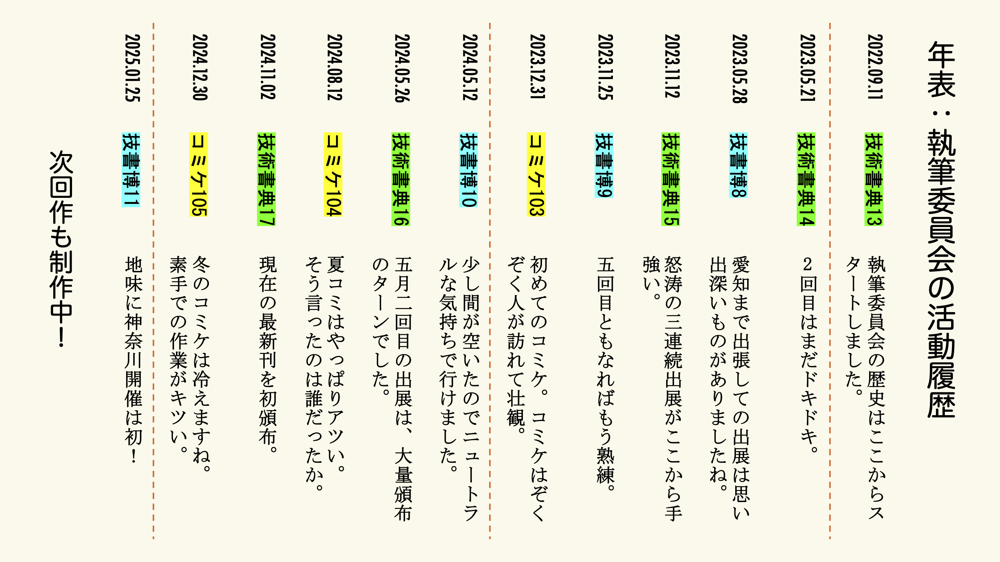

# 執筆委員会とは

執筆委員会は、ゆめみブランド向上のため、書籍執筆（技術同人誌および商業出版）を推進する委員会です。とくに、自分たちの意志で本を発行できる技術同人誌の形での本の製作に力を入れています。

## ゆめみ大技林製作委員会

ゆめみ大技林製作委員会は、ゆめみの有志メンバーによる技術同人誌サークルです。現在、次回作である「ゆめみ大技林 '25」の製作を進めています。

ゆめみ大技林は、複数の著者によるアンソロジー本です。章ごとに異なる著者が独立した内容を書いています。内容についてのテーマ設定はおこなわず、各著者が好きなことを書いてよいことにしています。

<section class="book">
    

        

            
        

        

            <h3>ゆめみ大技林 '24 (2)</h3>
            
現在の最新刊です。「エンジニア向けオフライン勉強会の始め方」「Swiftでより優雅な範囲判定」などの記事があります。

            
今日の新歓祭で紙版を配布しています。

            
また、電子版がBOOTHでダウンロードできます。ぜひご覧ください。 BOOTH : https://yumemi-inc.booth.pm/ （BOOTHはピクシブ株式会社が運営する、創作物が集まるマーケットプレイスです）

        

    

</section>

<section class="book">
    

        

            
        

        

            <h3>ゆめみ大技林 '24</h3>
            
「Rust Nannou作図事例」「iOSにおける非同期型イベント駆動」「feedit-feedbackの哲学」「コミットに署名するとはどういうことなのか」などの記事があります。今回は厚みは少なめの本ですが、内容はバラエティに富んだものになっています。

        

    

</section>

<section class="book">
    

        

            
        

        

            <h3>ゆめみ大技林 '23 (2)</h3>
            
内容が充実している「SwiftData入門」「Logger入門」などの記事のほか、「モバイルアプリの操作方法を疑ってみる」では既存のUIガイドラインを見つめ直しています。歴代でもっとも厚みがある本です。ベストプラクティス満載の1冊となりました。

        

    

</section>

<section class="book">
    

        

            
        

        

            <h3>ゆめみ大技林 '23</h3>
            
無事に2冊目となりました。iOS限定ではなくなり、執筆委員会の活動範囲を広げる第一歩となった本です。

        

    

</section>

<section class="book">
    

        

            
        

        

            <h3>ゆめみ大技林 '22</h3>
            
ゆめみ大技林製作委員会のはじめての本です。最初は執筆委員会自体がJIKKENとして始まり、小さい規模で試行するためにiOSギルドのメンバーで始めました。

        

    

</section>

## 技術書イベント

技術同人誌を頒布できるイベントはいくつかあります。ゆめみ大技林製作委員会は、次の 3 つのイベントへの参加実績があります。

### 技術書典

技術書オンリーの即売会イベントでは、最大級の規模です。ゆめみも過去に何度かスポンサーをしています。

### 技術書同人誌博覧会（技書博）

技術書オンリーで、規模が大きめの即売会イベントです。商業出版社も多く参加しているなどの特徴があります。

### コミックマーケット（コミケ）

同人誌即売会のなかで最大級であり知名度が高いイベントです。技術書オンリーのイベントではありませんが、技術同人誌サークルも多く出展されています。

## 執筆者募集！

ゆめみ大技林製作委員会では、執筆者を募集しています。

本を製作することに興味があっても、実際に本を製作するのはなかなか大変です。そこで、まずはゆめみ大技林の執筆者の一人として参加することをお勧めしています。少ない労力で本を出す経験が得られ、本の製作過程を体験しながら知ることができます。ぜひ Slack チャンネル `#809_執筆委員会` までお声かけください。

## 技術カンファレンスのノベルティで技術書を配りませんか？

執筆委員会は、技術カンファレンスで配るノベルティ技術書の製作をお手伝いします！

<section class="book">
    

        

            
        

        

            <h3>YUMEMI TECHBOOK Flutter 2024</h3>
            
2024年11月21〜22日に開催されたFlutterKaigi 2024のスポンサーブースで配布しました。用意した100部が初日で配布されました。

            
過去にゆめみ大技林に掲載した記事と、新たに書き下ろした記事を掲載しています。

            
BOOTHで電子版を配布中ですので、ぜひご覧ください。 BOOTH : https://yumemi-inc.booth.pm/

        

    

</section>

<section class="book">
    

        

            
        

        

            <h3>エンジニア大喜利傑作選</h3>
            
2023年のiOSDC Japan、DroidKaigi、FlutterKaigiそれぞれのスポンサーブースで配布しました。

            
株式会社ゆめみの公式𝕏アカウントでエンジニアの皆さんに向けた大喜利を出題しました。この本では、みなさんの回答の中から特に面白かったものをまとめました。

            
BOOTHで電子版を配布中ですので、ぜひご覧ください。 BOOTH : https://yumemi-inc.booth.pm/

        

    

</section>

<section class="text-image">
    

        

            <h3>製作手順</h3>
            
執筆委員会が執筆用リポジトリを用意します。Markdownで記事を書いてください。印刷の手配なども執筆委員会が行います。

            
詳しくは、Notionの「技術カンファレンスのノベルティで技術同人誌を作りませんか？」のページをご覧ください。

        

        

            
        

    

</section>
